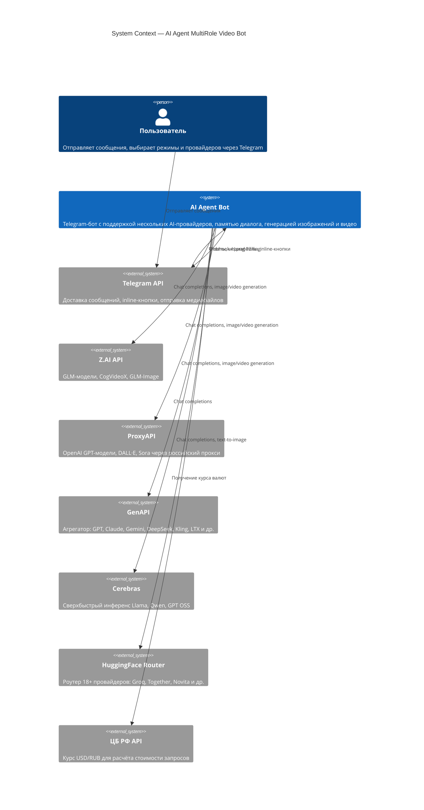
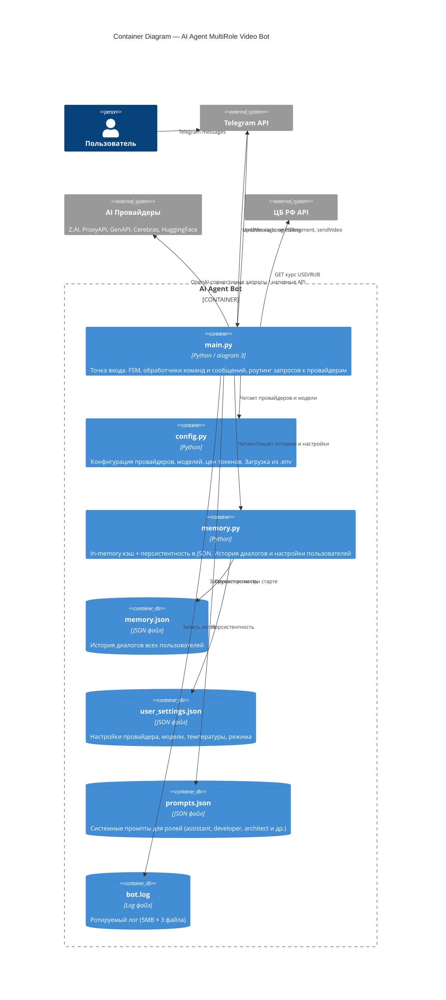
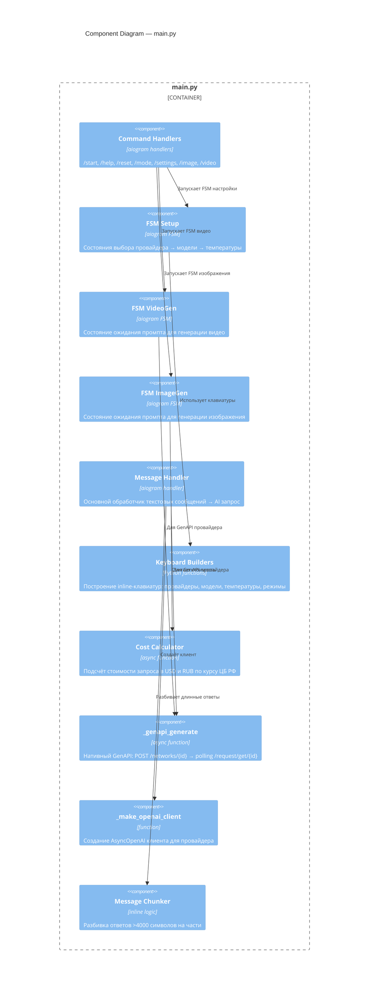
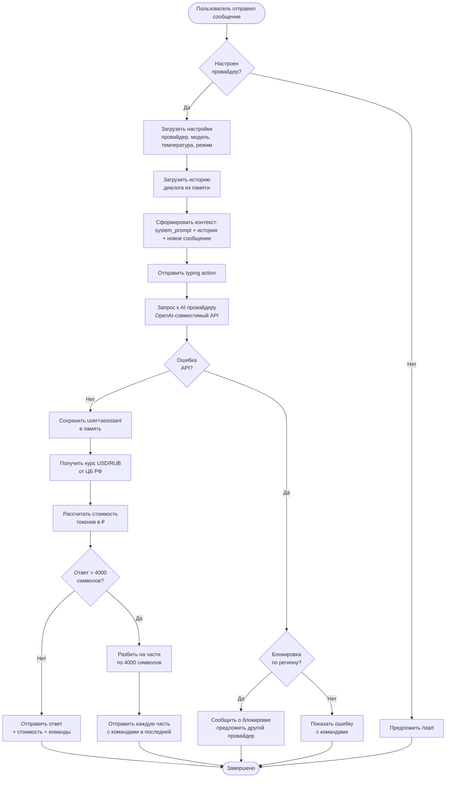
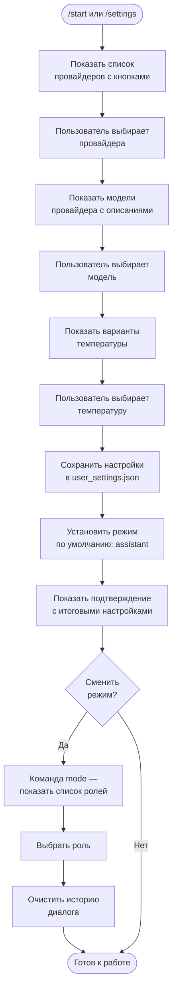
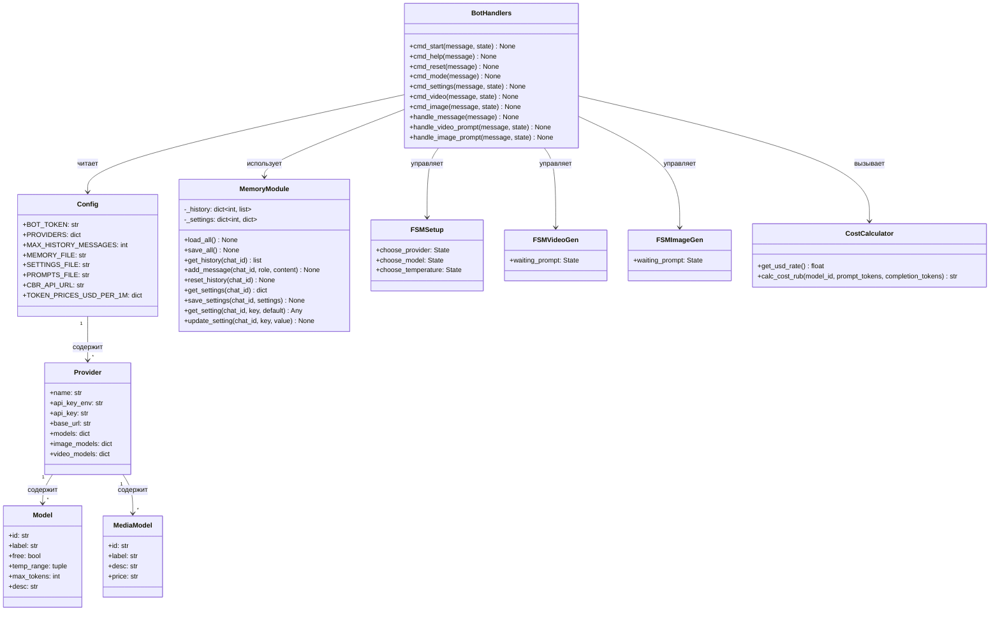
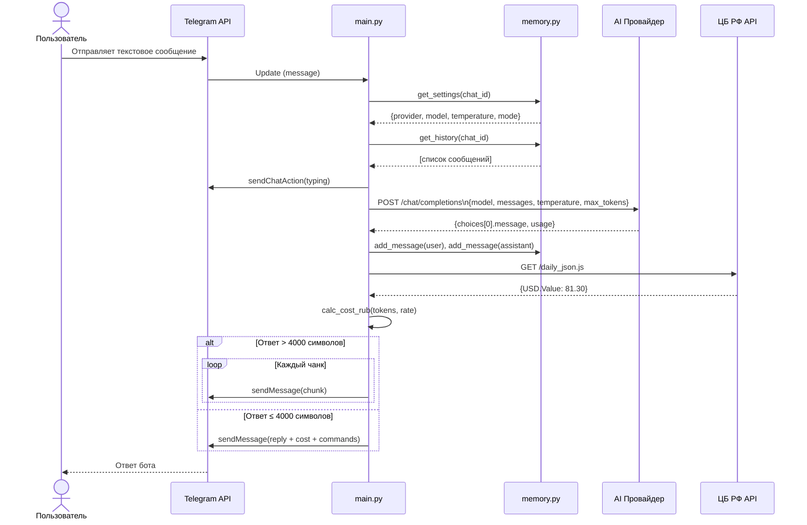
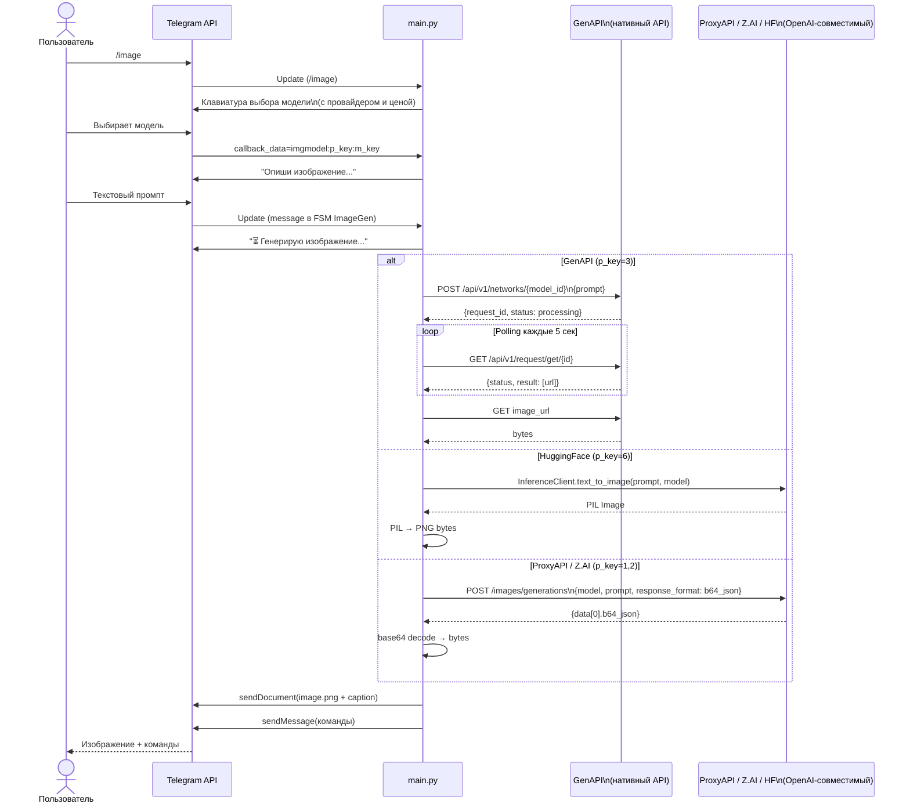
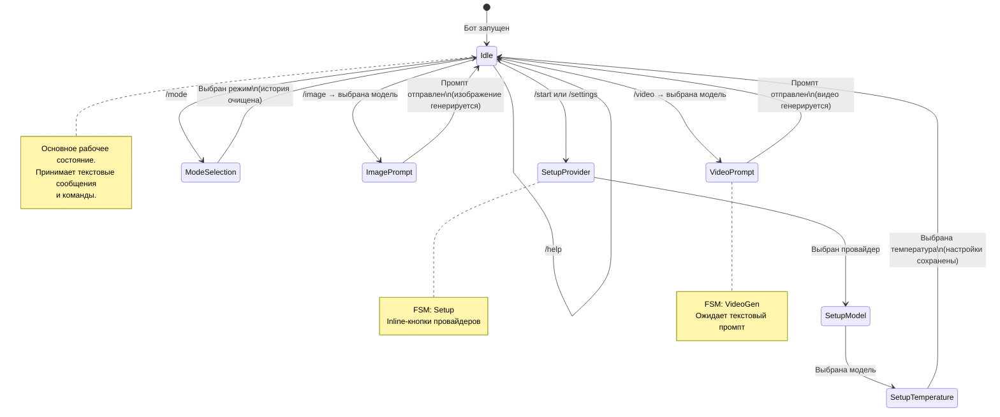

# Архитектура AI Agent MultiRole Video Bot

## Содержание
1. [Обзор системы (C4 — System Context)](#c4-system-context)
2. [Контейнеры (C4 — Container)](#c4-container)
3. [Компоненты (C4 — Component)](#c4-component)
4. [Бизнес-процесс обработки сообщения (BPMN)](#bpmn-обработка-сообщения)
5. [Бизнес-процесс первичной настройки (BPMN)](#bpmn-первичная-настройка)
6. [Диаграмма классов (UML)](#uml-диаграмма-классов)
7. [Диаграмма последовательности — чат (UML)](#uml-последовательность-чат)
8. [Диаграмма последовательности — генерация изображения (UML)](#uml-последовательность-изображение)
9. [Диаграмма состояний (UML)](#uml-диаграмма-состояний)

---

## C4 — System Context

Уровень 1: система в контексте внешних участников.

---

## C4 — Container

Уровень 2: внутренние контейнеры системы.

---

## C4 — Component

Уровень 3: компоненты внутри `main.py`.

---

## BPMN — Обработка сообщения

Бизнес-процесс обработки входящего текстового сообщения пользователя.

---

## BPMN — Первичная настройка

Процесс первичной настройки бота пользователем через FSM.

---

## UML — Диаграмма классов

---

## UML — Последовательность: чат

---

## UML — Последовательность: генерация изображения

---

## UML — Диаграмма состояний

FSM-состояния бота для одного пользователя.

